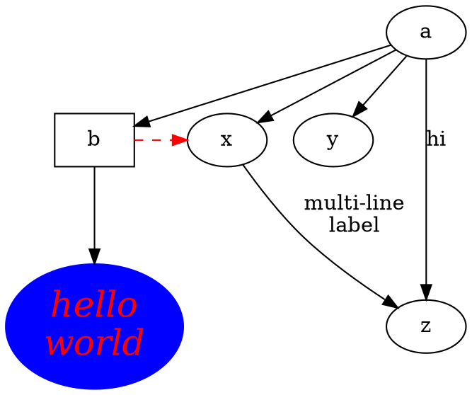

# A dot example

A `dot`-example taken from the man-pages. You need to install the `graphviz` package.

```dot
digraph test123 {
  a -> b -> c;
  a -> {x y};
  b [shape=box];
  c [label="hello\nworld",color=blue,fontsize=24,
      fontname="Palatino-Italic",fontcolor=red,style=filled];
  a -> z [label="hi", weight=100];
  x -> z [label="multi-line\nlabel"];
  edge [style=dashed,color=red];
  b -> x;
  {rank=same; b x}
}
```

 

